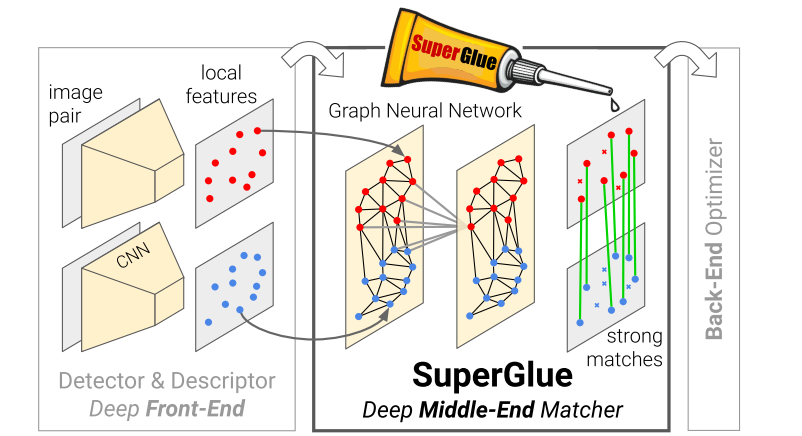
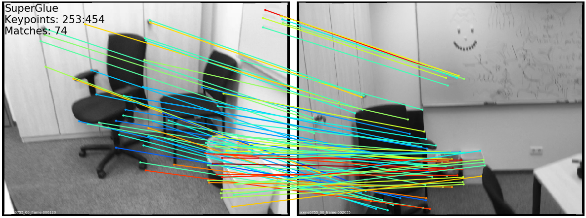
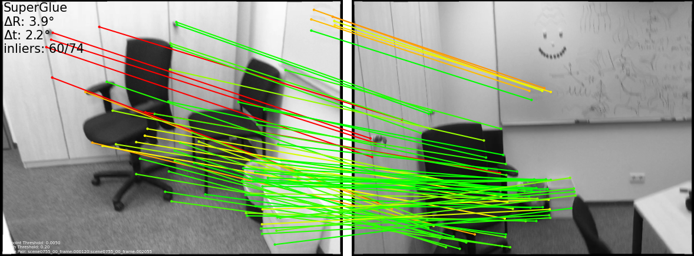
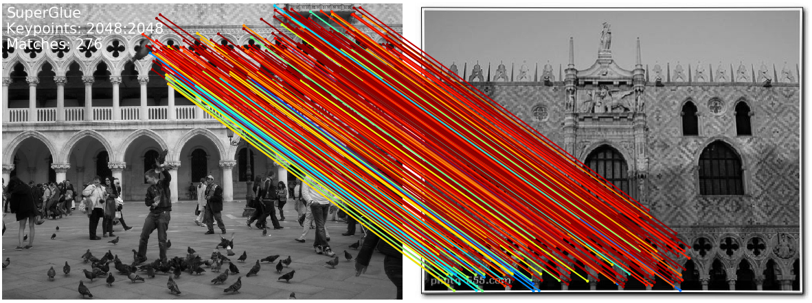

### Research @ Magic Leap (CVPR 2020, Oral)

# SuperGlue Inference and Evaluation Demo Script

## Introduction
SuperGlue is a CVPR 2020 research project done at Magic Leap. The SuperGlue network is a Graph Neural Network combined with an Optimal Matching layer that is trained to perform matching on two sets of sparse image features. This repo includes PyTorch code and pretrained weights for running the SuperGlue matching network on top of [SuperPoint](https://arxiv.org/abs/1712.07629) keypoints and descriptors. Given a pair of images, you can use this repo to extract matching features across the image pair.



SuperGlue operates as a "middle-end," performing context aggregation, matching, and filtering in a single end-to-end architecture. For more details, please see:

* Full paper PDF: [SuperGlue: Learning Feature Matching with Graph Neural Networks](https://arxiv.org/abs/1911.11763).

* Authors: *Paul-Edouard Sarlin, Daniel DeTone, Tomasz Malisiewicz, Andrew Rabinovich*

We provide two pre-trained weights files: an indoor model trained on ScanNet data, and an outdoor model trained on MegaDepth data. Both models are inside the [weights directory](./models/weights). By default, the demo will run the **indoor** model.

## Dependencies
* Python 3
* PyTorch >= 1.1
* OpenCV >= 3.4 (4.1.2.30 recommended for best GUI keyboard interaction, see this [note](#additional-notes))
* Matplotlib >= 3.1
* NumPy >= 1.18

Simply run the following command: `pip3 install numpy opencv-python torch matplotlib`

## Contents
There are two main top-level scripts in this repo:

1. `demo_superglue.py` : runs a live demo on a webcam, IP camera, image directory or movie file
2. `match_pairs.py`: reads image pairs from files and dumps matches to disk (also runs evaluation if ground truth relative poses are provided)

## Live Matching Demo Script (`demo_superglue.py`)
This demo runs SuperPoint + SuperGlue feature matching on an anchor image and live image. You can update the anchor image by pressing the `n` key. The demo can read image streams from a USB or IP camera, a directory containing images, or a video file. You can pass all of these inputs using the `--input` flag.

### Run the demo on a live webcam

Run the demo on the default USB webcam (ID #0), running on a CUDA GPU if one is found:

```sh
./demo_superglue.py
```

Keyboard control:

* `n`: select the current frame as the reference
* `e`/`r`: increase/decrease the detector confidence threshold
* `d`/`f`: increase/decrease the match filtering threshold
* `k`: toggle the visualization of keypoints
* `q`: quit

Run the demo on 320x240 images running on the CPU:

```sh
./demo_superglue.py --resize 320 240 --force_cpu
```

### Run the demo on a directory of images

The `--input` flag also accepts paths to directories. We provide a directory of sample images from a sequence. To run the demo on the directory of images in `freiburg_sequence/` on a headless server (will not display to the screen) and write to `dump_demo_sequence/`:

```sh
./demo_superglue.py --input assets/freiburg_sequence/ --resize 320 240 --no_display --write --write_dir dump_demo_sequence
```

You should see this output on the sample Freiburg-TUM RGBD sequence:


The matches are colored by their predicted confidence in a jet colormap (Red: more confident, Blue: less confident).

### Additional useful command line parameters
* Use `--display_scale` to scale the output visualization image height and width (default: `1`).
* Use `--image_glob` to change the image file extension (default: `*.png`, `*.jpg`, `*.jpeg`).
* Use `--skip` to skip intermediate frames (default: `1`).
* Use `--show_keypoints` to visualize the detected keypoints (default: `False`).

## Run Matching+Evaluation (`match_pairs.py`)

This repo also contains a script `match_pairs.py` that runs the matching from a list of image pairs. With this script, you can:

* Run the matcher on a set of image pairs (no ground truth needed)
* Visualize the keypoints and matches, based on their confidence
* Evaluate and visualize the match correctness, if the ground truth relative poses and intrinsics are provided
* Save the keypoints, matches, and evaluation results for further processing
* Collate evaluation results over many pairs and generate result tables

### Matches only mode

The simplest usage of this script will process the image pairs listed in a given text file and dump the keypoints and matches to compressed numpy `npz` files. We provide the challenging ScanNet pairs from the main paper in `assets/example_indoor_pairs/`. Running the following will run SuperPoint + SuperGlue on each image pair, and dump the results to `dump_match_pairs/`:

```sh
./match_pairs.py
```

The resulting `.npz` files can be read from Python as follows:

```python
>>> import numpy as np
>>> path = 'dump_match_pairs/scene0711_00_frame-001680_scene0711_00_frame-001995_matches.npz'
>>> npz = np.load(path)
>>> npz.files
['keypoints0', 'keypoints1', 'matches', 'match_confidence']
>>> npz['keypoints0'].shape
(382, 2)
>>> npz['keypoints1'].shape
(391, 2)
>>> npz['matches'].shape
(382,)
>>> np.sum(npz['matches']>-1)
115
>>> npz['match_confidence'].shape
(382,)
```

For each keypoint in `keypoints0`, the `matches` array indicates the index of the matching keypoint in `keypoints1`, or `-1` if the keypoint is unmatched.

### Visualization mode

You can add the flag `--viz` to dump image outputs which visualize the matches:

```sh
./match_pairs.py --viz
```

You should see images like this inside of `dump_match_pairs/` (or something very close to it, see this [note](#a-note-on-reproducibility)):



The matches are colored by their predicted confidence in a jet colormap (Red: more confident, Blue: less confident).

### Evaluation mode

You can also estimate the pose using RANSAC + Essential Matrix decomposition and evaluate it if the ground truth relative poses and intrinsics are provided in the input `.txt` files. Each `.txt` file contains three key ground truth matrices: a 3x3 intrinsics matrix of image0: `K0`, a 3x3 intrinsics matrix of image1: `K1` , and a 4x4 matrix of the relative pose extrinsics `T_0to1`.

To run the evaluation on the sample set of images (by default reading `assets/scannet_sample_pairs_with_gt.txt`), you can run:

```sh
./match_pairs.py --eval
```


Since you enabled `--eval`, you should see collated results printed to the terminal. For the example images provided, you should get the following numbers (or something very close to it, see this [note](#a-note-on-reproducibility)):

```txt
Evaluation Results (mean over 15 pairs):
AUC@5    AUC@10  AUC@20  Prec    MScore
26.99    48.40   64.47   73.52   19.60
```

The resulting `.npz` files in `dump_match_pairs/` will now contain scalar values related to the evaluation, computed on the sample images provided. Here is what you should find in one of the generated evaluation files:

```python
>>> import numpy as np
>>> path = 'dump_match_pairs/scene0711_00_frame-001680_scene0711_00_frame-001995_evaluation.npz'
>>> npz = np.load(path)
>>> print(npz.files)
['error_t', 'error_R', 'precision', 'matching_score', 'num_correct', 'epipolar_errors']
```

You can also visualize the evaluation metrics by running the following command:

```sh
./match_pairs.py --eval --viz
```

You should also now see additional images in `dump_match_pairs/` which visualize the evaluation numbers (or something very close to it, see this [note](#a-note-on-reproducibility)):



The top left corner of the image shows the pose error and number of inliers, while the lines are colored by their epipolar error computed with the ground truth relative pose (red: higher error, green: lower error).

### Running on sample outdoor pairs

<details>
  <summary>[Click to expand]</summary>

In this repo, we also provide a few challenging Phototourism pairs, so that you can re-create some of the figures from the paper. Run this script to run matching and visualization (no ground truth is provided, see this [note](#reproducing-outdoor-evaluation-final-table)) on the provided pairs:

```sh
./match_pairs.py --resize 1600 --superglue outdoor --max_keypoints 2048 --nms_radius 3  --resize_float --data_dir assets/phototourism_sample_images/ --pairs_list assets/phototourism_sample_pairs.txt --results_dir dump_match_pairs_outdoor --viz
```

You should now image pairs such as these in `dump_match_pairs_outdoor/` (or something very close to it, see this [note](#a-note-on-reproducibility)):




</details>

### Recommended settings for indoor / outdoor

<details>
  <summary>[Click to expand]</summary>

For **indoor** images, we recommend the following settings (these are the defaults):

```sh
./match_pairs.py --resize 640 --superglue indoor --max_keypoints 1024 --nms_radius 4
```

For **outdoor** images, we recommend the following settings:

```sh
./match_pairs.py --resize 1600 --superglue outdoor --max_keypoints 2048 --nms_radius 3 --resize_float
```

You can provide your own list of pairs `--pairs_list` for images contained in `--data_dir`. Images can be resized before network inference with `--resize`. If you are re-running the same evaluation many times, you can use the `--cache` flag to reuse old computation.
</details>

### Test set pair file format explained

<details>
  <summary>[Click to expand]</summary>

We provide the list of ScanNet test pairs in `assets/scannet_test_pairs_with_gt.txt` (with ground truth) and Phototourism test pairs `assets/phototourism_test_pairs.txt` (without ground truth) used to evaluate the matching from the paper. Each line corresponds to one pair and is structured as follows:

```
path_image_A path_image_B exif_rotationA exif_rotationB [KA_0 ... KA_8] [KB_0 ... KB_8] [T_AB_0 ... T_AB_15]
```

The `path_image_A` and `path_image_B` entries are paths to image A and B, respectively. The `exif_rotation` is an integer in the range [0, 3] that comes from the original EXIF metadata associated with the image, where, 0: no rotation, 1: 90 degree clockwise, 2: 180 degree clockwise, 3: 270 degree clockwise. If the EXIF data is not known, you can just provide a zero here and no rotation will be performed. `KA` and `KB` are the flattened `3x3` matrices of image A and image B intrinsics. `T_AB` is a flattened `4x4` matrix of the extrinsics between the pair.
</details>

### Reproducing indoor evaluation final table

<details>
  <summary>[Click to expand]</summary>

In order to reproduce similar tables to what was in the paper, you will need to obtain the raw test set images (we do not include them in this repo). We list the scenes and images in `assets/scannet_test_images.txt`. We provide the groundtruth in our format in the file `assets/scannet_test_pairs_with_gt.txt` for convenience. If you put the raw images in the directory `assets/scannet_test_images/`, you can reproduce the full results with:

```sh
./match_pairs.py --eval --pairs_list assets/scannet_test_pairs_with_gt.txt --data_dir assets/scannet_test_images/ --results_dir dump_scannet_test_results
```

You should get the following table for ScanNet (or something very close to it, see this [note](#a-note-on-reproducibility)):

```txt
Evaluation Results (mean over 1500 pairs):
AUC@5    AUC@10  AUC@20  Prec    MScore
16.12    33.76   51.79   84.37   31.14
```

</details>

### Reproducing outdoor evaluation final table

<details>
  <summary>[Click to expand]</summary>

The Phototourism results shown in the paper were produced using similar data as the test set from the [Image Matching Workshop](https://vision.uvic.ca/image-matching-challenge/), which does not contain publically available ground truth data for the test set. We list the pairs we used in `assets/phototourism_test_pairs.txt`. To reproduce similar numbers on this test set, please use the image matching workshop benchmark. While the challenge is still live, we cannot share the test set publically since we want to help maintain the integrity of the challenge.

</details>

### Outdoor training / validation scene split

<details>
  <summary>[Click to expand]</summary>

For training and validation of the outdoor model, we used scenes from the [MegaDepth dataset](http://www.cs.cornell.edu/projects/megadepth/). We provide the list of scenes used to train the outdoor model in the `assets/` directory:

* Training set: `assets/megadepth_train_scenes.txt`
* Validation set: `assets/megadepth_validation_scenes.txt`

</details>

### A note on reproducibility

<details>
  <summary>[Click to expand]</summary>

After simplifying the model code and evaluation code and preparing it for release, we made some improvements and tweaks that result in slightly different numbers than what was reported in the paper. The numbers and figures reported in the README were done using Ubuntu 16.04, OpenCV 3.4.5, and PyTorch 1.1.0. Even with matching the library versions, we observed some slight differences across Mac and Ubuntu, which we believe are due to differences in OpenCV's image resize function implementation and randomization of RANSAC.
</details>

### Creating high-quality PDF visualizations and --fast_viz

<details>
  <summary>[Click to expand]</summary>

When generating output images with `match_pairs.py`, the default `--viz` flag uses a Matplotlib renderer which allows for the generation of camera-ready PDF visualizations if you additionally use `--viz_extension pdf` instead of the default png extension.

```
./match_pairs.py --viz --viz_extension pdf
```

Alternatively, you might want to save visualization images but have
the generation be much faster.  You can use the `--fast_viz` flag to
use an OpenCV-based image renderer as follows:

```
./match_pairs.py --viz --fast_viz
```

If you would also like an OpenCV display window to preview the results (you must use non-pdf output and use fast_fiz), simply run:

```
./match_pairs.py --viz --fast_viz --opencv_display
```

</details>


## BibTeX Citation
If you use any ideas from the paper or code from this repo, please consider citing:

```txt
@inproceedings{sarlin20superglue,
  author    = {Paul-Edouard Sarlin and
               Daniel DeTone and
               Tomasz Malisiewicz and
               Andrew Rabinovich},
  title     = {SuperGlue: Learning Feature Matching with Graph Neural Networks},
  booktitle = {CVPR},
  year      = {2020},
  url       = {https://arxiv.org/abs/1911.11763}
}
```

## Additional Notes
* For the demo, we found that the keyboard interaction works well with OpenCV 4.1.2.30, older versions were less responsive and the newest version had a [OpenCV bug on Mac](https://stackoverflow.com/questions/60032540/opencv-cv2-imshow-is-not-working-because-of-the-qt)
* We generally do not recommend to run SuperPoint+SuperGlue below 160x120 resolution (QQVGA) and above 2000x1500
* We do not intend to release the SuperGlue training code.

## Legal Disclaimer
Magic Leap is proud to provide its latest samples, toolkits, and research projects on Github to foster development and gather feedback from the spatial computing community. Use of the resources within this repo is subject to (a) the license(s) included herein, or (b) if no license is included, Magic Leap's [Developer Agreement](https://id.magicleap.com/terms/developer), which is available on our [Developer Portal](https://developer.magicleap.com/).
If you need more, just ask on the [forums](https://forum.magicleap.com/hc/en-us/community/topics)!
We're thrilled to be part of a well-meaning, friendly and welcoming community of millions.
